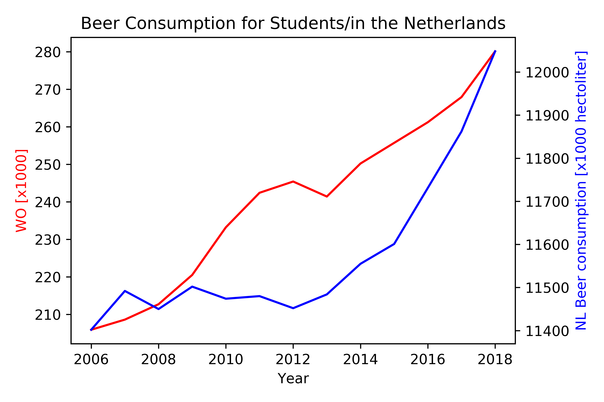

- Van Dyke, M. C. C., Teixeira, M. M., & Barker, B. M. (2019). Fantastic yeasts and where to find them: the hidden diversity of dimorphic fungal pathogens. Current opinion in microbiology, 52, 55-63.
- Harvey, J. T., Culvenor, J., Payne, W., Cowley, S., Lawrance, M., Stuart, D., & Williams, R. (2002). An analysis of the forces required to drag sheep over various surfaces. Applied Ergonomics, 33(6), 523-531.
- Zeigler, D. W., Wang, C. C., Yoast, R. A., Dickinson, B. D., McCaffree, M. A., Robinowitz, C. B., & Sterling, M. L. (2005). The neurocognitive effects of alcohol on adolescents and college students. Preventive medicine, 40(1), 23-32.


```{python}
import pandas as pd
import matplotlib.pyplot as plt

# Read the data from the CSV and interpret it as a TSV
data = pd.read_csv('istherecorrelation.csv', sep=';', decimal = ',')

# Assign the different columns of the CSV to x/y axis data
x = data['Year']
y1 = data['WO [x1000]']
y2 = data['NL Beer consumption [x1000 hectoliter]']

# Plot the data
fig, ax1 = plt.subplots()
ax1.set_title('Beer Consumption for Students/in the Netherlands')
ax2 = ax1.twinx()
ax1.plot(x, y1, 'r-')
ax2.plot(x, y2, 'b-')

# Label the axis
ax1.set_xlabel('Year')
ax1.set_ylabel('WO [x1000]', color='r')
ax2.set_ylabel('NL Beer consumption [x1000 hectoliter]', color='b')

# Save the graph as a png
plt.tight_layout()
plt.savefig('graph.png', dpi = 600)

# Show the graph
plt.show()
```


